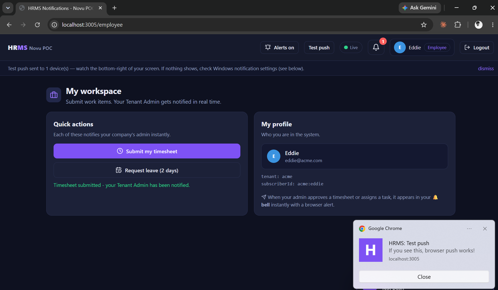
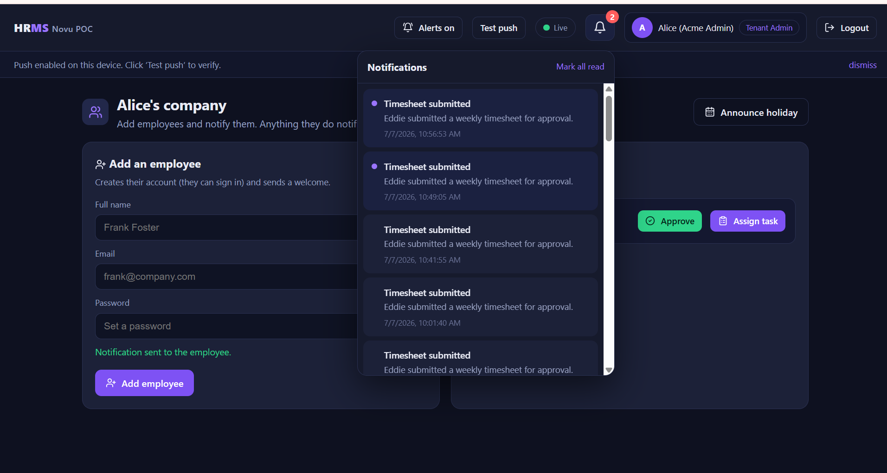
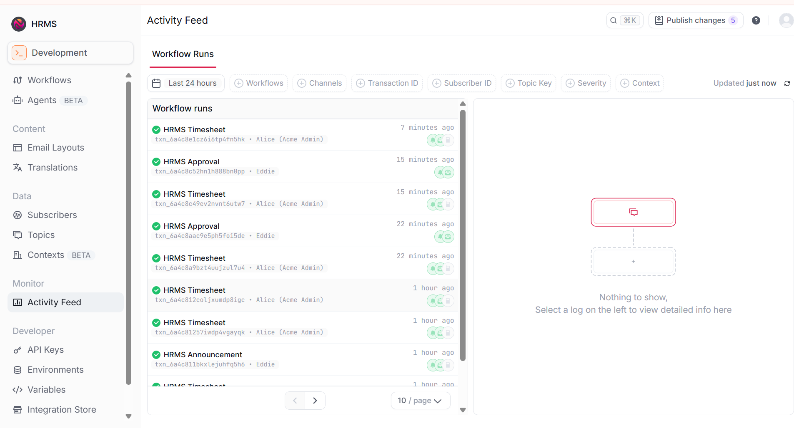
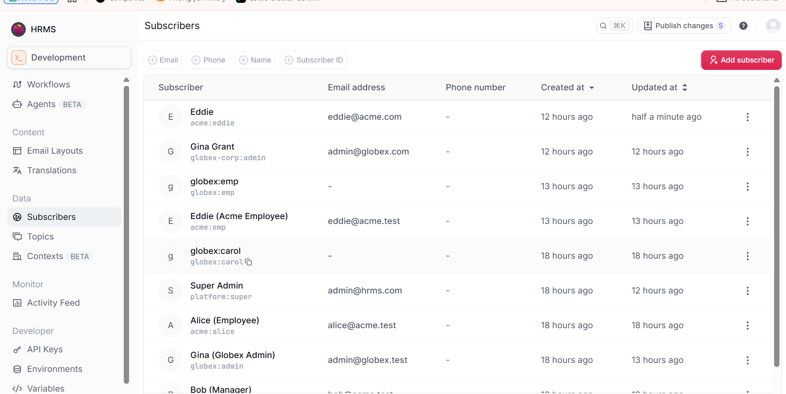

# HRMS × Novu — Notification POC

A multi-tenant **HRMS notification system** proof-of-concept: a **Next.js** app with three roles
(Superadmin → Tenant Admin → Employee), powered by self-hosted **Novu** for in-app + email +
real-time, and our **own Web Push (VAPID, no Firebase)** for real browser notifications that work
even when the tab is closed.

**Channels:** 🔔 in-app bell (real-time socket) · ✉️ email · 🖥️ desktop push · all **tenant-isolated**.

---

## 📸 Screenshots

### Real browser push notification — works even when Chrome is minimized/closed
Our own **Web Push (VAPID)** — no Firebase, no paid service. The desktop banner is fired by a
service worker, so it shows with no tab open.



### In-app notification bell (real-time)
A Tenant Admin sees every employee action instantly in the 🔔 bell, delivered over the Novu socket
(the green **“Live”** pill shows the socket is connected).



### Novu Activity Feed — every notification as a workflow run
Each notification is a Novu workflow run (in-app + email steps) with per-run delivery status.



### Tenant-isolated subscribers
Subscribers use a composite id **`tenant:user`**, so the same person in two tenants stays fully
isolated — no cross-tenant leakage.



---

## 🚀 Run it locally (fresh clone)

**Prerequisites:** Docker Desktop, Node.js 20+, PowerShell (Windows).

```powershell
# 1. Start the self-hosted Novu stack (api + worker + ws + dashboard + mongo + redis + Mailpit)
cd deploy
Copy-Item .env.example .env
powershell -File ..\scripts\gen-secrets.ps1        # fills deploy/.env with fresh secrets
docker compose --env-file .env up -d               # first run pulls images (~2 min)

# 2. Provision Novu in one command (creates org + keys + HMAC + workflows, writes keys to deploy/.env)
cd ..
powershell -File scripts\bootstrap.ps1

# 3. Set up + run the web app
cd hrms-web
npm install
powershell -File ..\scripts\setup-web-env.ps1      # writes hrms-web/.env.local (Novu keys + VAPID)
npm run dev
```

Open **http://localhost:3005** and sign in with a sample account:

| Role | Email | Password |
|---|---|---|
| Superadmin | `admin@hrms.com` | `Bsandeep123?` |
| Tenant Admin | `admin@acme.com` | `Acme123?` |
| Employee | `eddie@acme.com` | `Emp123?` |

**Try it:** sign in as the Employee → **Submit my timesheet**; sign in as the Tenant Admin (another
tab) → their 🔔 bell updates live. Click **Enable alerts** then **Test push** to get the desktop
notification. Full walkthrough + the Chrome-closed push test: **[docs/TESTING.md](docs/TESTING.md)**.

> **Push not appearing on Windows?** Enable Chrome notifications: **Settings → System → Notifications →
> Google Chrome → On**, and turn **off** "Do not disturb". (The push code is correct; Windows just has
> to be allowed to display it.) Details: **[docs/PUSH.md](docs/PUSH.md)**.

---

## 🌐 Ports

| Port | Service | Use |
|---|---|---|
| **3005** | HRMS app (Next.js) | login + the 3 role dashboards |
| **4000** | Novu dashboard | workflows, integrations, subscribers, activity feed |
| 3010 | Novu API | triggers + HMAC inbox session |
| 3011 | Novu WebSocket | real-time → the green “Live” pill |
| 8025 | Mailpit | view business-event emails |
| 3000 | *(the real HRMS frontend — untouched)* | why this POC uses 3005 |

---

## 🏗️ How it works

- **Novu** owns in-app (bell/inbox), email, real-time socket, workflows, preferences, tenant isolation.
- **Our Web Push (VAPID)** owns the desktop/browser push — self-hosted, no Firebase (`lib/webpush.js`).
- **One `notify()` call** (`lib/notify.js`) fans out to every channel, so feature code never sees the split.
- **3 roles**: Superadmin creates tenants → Tenant Admin creates employees → Employee submits work;
  each action notifies the right people, tenant-isolated by the `tenant:user` subscriber id.

Deep dives: **[docs/ARCHITECTURE.md](docs/ARCHITECTURE.md)** · **[docs/SECURITY.md](docs/SECURITY.md)** ·
**[docs/PUSH.md](docs/PUSH.md)** · **[docs/OPERATIONS.md](docs/OPERATIONS.md)**.

---

## ☁️ Deploy for a shareable link (Vercel)

Deliver a public link to the team via **Vercel** (app) + **Upstash Redis** (store) + **Novu Cloud**
(engine) — all free tiers. Step-by-step with env vars and preview/dev links:
**[docs/DEPLOY-VERCEL.md](docs/DEPLOY-VERCEL.md)**. The code already switches to Upstash automatically
when its env vars are present (files locally, Redis on Vercel).

---

## 📁 Repository layout

```
NOVU-POC/
├── hrms-web/                 # THE APP — Next.js 14 (3 roles, bell, real-time, Web Push)
│   ├── app/                  #   pages (login, superadmin, admin, employee) + api routes
│   ├── components/           #   Shell (nav+bell+toast), useInbox (socket+push), useAuth
│   ├── lib/                  #   novu.js, webpush.js (VAPID), notify.js, store.js, data.js
│   └── public/sw.js          #   Web Push service worker
├── deploy/                   # self-hosted Novu stack (docker-compose) + Mailpit
├── scripts/                  # bootstrap / configure / setup-web-env / gen-secrets / smoke-test
├── bridge/                   # drop-in integration for the real HRMS notification-service (reference)
├── demo/                     # lighter FastAPI/HTML demo (alternative to the Next.js app)
└── docs/                     # architecture, security, push, testing, deploy, reuse, plan, screenshots
```

---

## 🔒 Notes

- Secrets live only in git-ignored env files (`deploy/.env`, `hrms-web/.env.local`); only `.env.example`
  templates are committed. CI fails the build if a secret or real env/data file is ever tracked.
- This is a POC data model (JSON store, plaintext demo passwords). For production, auth moves to Logto
  and the store into the real HRMS `notification-service` — see **[docs/ARCHITECTURE.md](docs/ARCHITECTURE.md)**.
